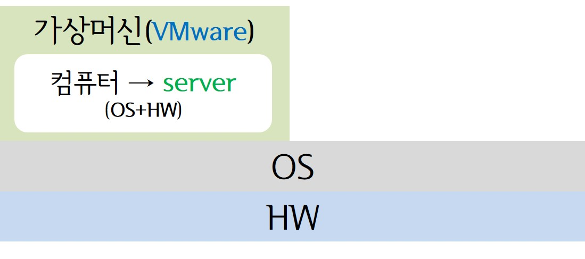
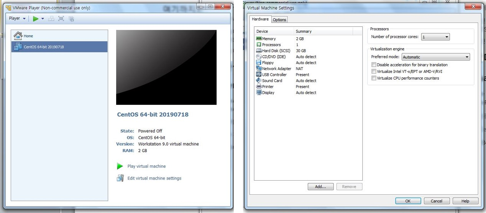

> day47 배운 내용 : Linux | CentOS | Virtual Machine (VMware) 

## 1. Linux

- Linux는 **OS(운영체제)의 일종**

  → OS는 HW와 SW를 연결해주고, SW를 구동하는데 필요한 HW의 자원을 분배하는 역할을 수행

- **Virtual Machine** **?**

  - 물리적인 컴퓨터에 Virtual Machine을 설치하면 여러 대의 컴퓨터에 여러 운영체제를 구동하는 것과 같은 효과를 제공 ∵ 가상머신 내에도 gateway와 OS, HW가 똑같이 존재하기 때문
  
  - Linux 운영체제가 동작하는 곳이 Virtual Machine :star:
  
    > Window 대신 Linux를 사용하여도 되지만 제한사항이 많기 때문에 우리가 사용하는 Window에 VMware을 다운 받은 후, Linux OS를 사용하는 것을 권장

- Linux의 장점

  - 비용을 지불해야 하는 Unix와 달리 무료로 이용이 가능

  - 하나의 물리적인 컴퓨터를 여러 공간으로 나누어 사용이 가능하므로 효율적인 관리가 가능 

    ∴ 빅데이터를 구축하는 환경에서는 필수 (메모리 용량과 문제 발생 시 메모리 보호 문제 때문?) 

  - 보안성이 우수하며 신뢰성과 호환성 또한 높음

  - swap을 이용하면 가상의 메모리를 만들어 물리적 메모리의 한계보다 더 많은 양의 사용이 가능

[ 참고 ] Unix (유닉스)

- Linux가 탄생하기 이전부터 널리 사용되어 왔으며, 현재까지도 가장 많이 사용되는 OS

- 상용 SW로 발전되어 왔으며, 현재는 무척 비싼 비용 지불이 필요

  → 이러한 Unix를 대체하기 위하여 탄생한 것이 Linux (동일한 기능과 역할을 수행하면서 무료로 제공)

## 2. 실습 환경 구축 

> Virtual Machine (VMware) 다운 받아 가상의 환경 만듦 : CentOS 64-bit download

