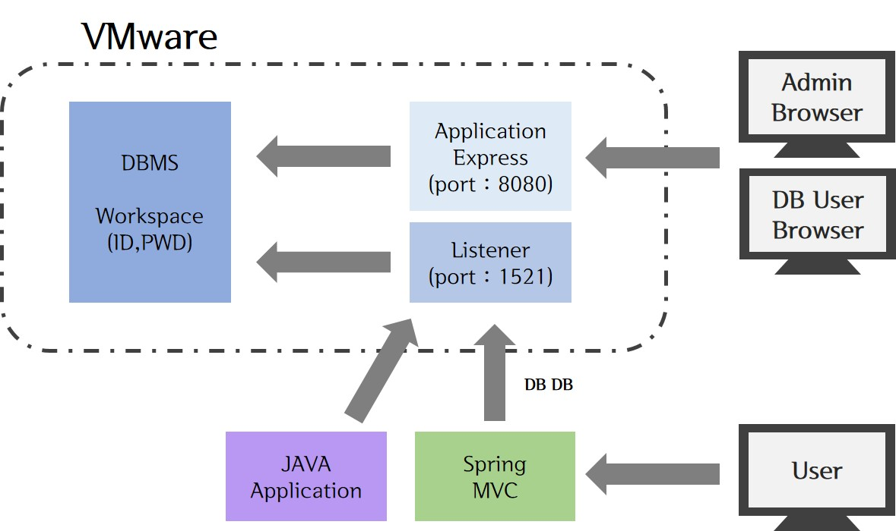
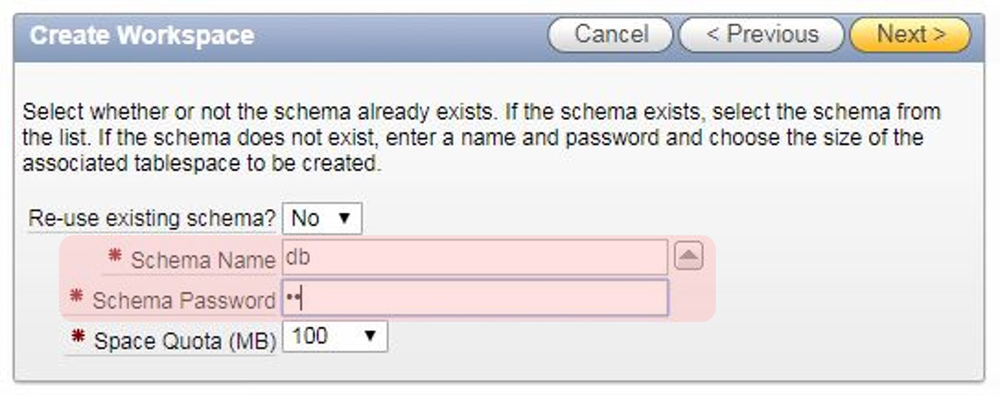
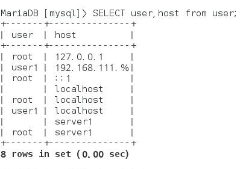

> day52 배운 내용 : Oracle | Tomcat과 WAR export | Linux 용어 정리 |MariaDB

## 1. Oracle



:warning: 'Workspace'의 아이디와 비밀번호로 DB에 접속 (스키마)  

:warning: user의 아이디와 비밀번호가 아님!!!​



### 1-1. Linux용 Oracle 설치

[day51 TIL 참고하기](https://github.com/xuansohx/TIL/blob/master/Linux/190724.md)

[1] Oracle 설치 파일 다운로드 후, VMware 내 /file로 가져옴

- http://www.oracle.co.kr/에 접속 → [Oracle Database 11g Express Edition] 
- License 동의한 후, [Oracle Database Express Edition 11g Release 2 for Linux x64] 다운

[2] '/file' 디렉토리로 이동 후 압축해제

```
cd file/
unzip oracle*
cd Disk1
ls -l oracle*
```

[3] Oracle Database Express 11g 설치 

> :star: 최소 1990MB 이상의 가상 메모리가 필요하므로 swap 추가하기

[4]​ 환경 설정

[5] Oracle 서버 열어주기 (방화벽 설정 실행)

[6]​ 웹 브라우저에서 Oracle 접속하여 확인하기

- Workspace / Username / Password 설정

### 1-2. OracleDB 구축

- Create Workspace 
- Create User → Admin과 user1, user2 생성

### 1-3. Oracle과 eclipse 연동

- eclipse Library에 'OracleDB' Library 추가
- Oracle과 연동을 위한 코드

```java
package oracledb;

import java.sql.Connection;
import java.sql.DriverManager;
import java.sql.PreparedStatement;
import java.sql.ResultSet;

public class Test {

	public static void main(String[] args)
	throws Exception{
			String id = "db";
			String pwd = "db";
			String url = "jdbc:oracle:thin:@192.168.111.101:1521:XE";
			
			Class.forName("oracle.jdbc.OracleDriver");
			
			Connection con = DriverManager.getConnection(url, id, pwd);
			
			String sql = "SELECT * FROM DEPT";
			
			PreparedStatement pstmt = con.prepareStatement(sql);
			
			ResultSet rset = pstmt.executeQuery();
			
			while(rset.next()) {
				int deptno = rset.getInt("DEPTNO");
				String dname = rset.getString("DNAME");
				String loc = rset.getString("LOC");
				System.out.println(deptno+" "+dname+" "+loc);
			}

	}

}
```

- Java Application을 실행하여 Console에 결과 출력되는 것 확인

## 2. Tomcat

> eclipse 프로젝트를 WAR 파일로 export 하여  tomcat에 배포하기

[0]​ Eclipse에서 해당 프로젝트를 우클릭 하여 war 파일로 export

[1]​ 만들어진 war 파일을 VMware 내 file 디렉토리로 가져옴 (→ 우리는 다운로드 파일을 'file/'에서 관리 중)

[2]​ war 파일 적용에 앞서 Tomcat의 상태를 확인

```
ps -ef  grep tomcat
```

[3]​ 터미널을 실행하여 **/webapps 디렉토리**로 copy

```
cp ~/file/*.war . → 현재 webapps 디렉토리에 있으므로 현재 위치로 복사하라는 '.'을 씀
```

<br>

**CASE 1. Project 생성 시 context root를 이름을 설정한 경우**

[4]​ **/bin 디렉토리로 이동한 후 서버 시작**

 ```
./shutdown.sh → 서버종료 (설정이 바꼈을 경우 서버종료 후 재시작)
startup.sh → 서버시작
 ```

> 앞에 './' 없이 `shutdown`만 입력하면 시스템 전체가 재부팅되니 주의할 것

:heavy_check_mark: 웹에서 server가 잘 동작하는지 확인 :  http://192.168.111.101/test 로 접속

> IP 주소 뒤에 우리가 정한 context root 이름을 입력


**CASE 2. Project 생성 시 context root를 '/'로 설정한 경우**


[4]  **/webapps** 내 ROOT 파일 존재 확인 → 명령어 `ls` 사용

- context root를 '/'로 설정하고 웹에 접속하면 VMware은 ROOT를 경로로 잡음

  → 이때  /webapps 에 이미 ROOT 파일이 존재하면 404오류가 발생

  ∴ 기존 ROOT의 이름을 바꾼 후, 우리가 실행하고자 하는 프로젝트명을 ROOT로 변경 (ex : test2 → ROOT)

```
mv ROOT ROOT_BACK
mv test2 ROOT
```

[5]​ 서버 종료 후 재시작 (**/bin** 디렉토리에서 실행)

```
./shutdown.sh → 서버종료 (설정이 바꼈을 경우 서버종료 후 재시작)
startup.sh → 서버시작
```

:heavy_check_mark: 웹에서 server가 잘 동작하는지 확인 :  http://192.168.111.101 로 접속

> context root를 '/'로 설정하면 IP 주소 뒤에 이름을 입력하지 않아도 됨

<br>

### 3. Linux 용어 정리

- 파이프(pipe) : 두 개의 프로그램을 연결해주는 연결 통로

```
ls -l /etc | more → 'ls -l /etc'를 입력하면 파일이 너무 많아, 1페이지 씩 나누어 보겠다는 의미
```

- 필터(filter) : 필요한 것만 걸러주는 명령어

> `grap`,  `tail`, `wc`, `sort`, `awk`, `sed` 명령어 등이 있음

```
ps -ef | grep oracle → 'oracle'이라는 글자가 들어간 모든 프로세스 출력 (여기서 'grep'이 필터 역할)
```

- kill : 프로세스를 강제로 종료하는 명령어 / '-9' 옵션과 함께 사용하면 무조건 프로세스가 종료

```
kill 프로세스 번호
kill -9 프로세스 번호 → 강제로 종료
```

- 리다이렉션(redirection) : 표준 입출력의 방향을 바꿔줌 

> 표준 입력은 키보드, 표준 출력은 모니터이지만 이를 파일로 처리하고 싶을 때 사용 

```
// 파일만들기
[root@server1 ~]# ls -la /etc > 20190725.txt

// 20190725.txt 파일을 sort 하겠음
[root@server1 ~]# sort < 20190725.txt 

// sort한 결과를 다시 파일로 만듦
[root@server1 ~]# sort < 20190725.txt > sort20190725.txt
```

> 화살표 방향이 입출력의 방향

-----------------------------------------------------------------------------------------------------------------------------------------------------------

- 프로세스(Process) : 하드디스크에 저장된 실행 코드(프로그램)가, 메모리에 로딩되어 활성화된 것
- `ps` : 현재 프로세스의 상태를 확인하는 명령어 / `ps -ef | grep 프로세스이름`으로 사용

- 포그라운드 프로세스(Foreground Process) : 실행 시 화면에 나타나서 사용자와 상호작용을 하는 프로세스
- 백그라운드 프로세스(Background Process) : 실행은 되지만 화면에 나타나지 않고 뒤에서 실행되는 프로세스
- 프로세스 번호 : 메모리에 로딩되어 활성화된 프로세스를 구분하는 고유 번호 → `kill`과 자주 사용됨
- 작업 번호 : 현재 실행되는 백그라운드 프로세스의 순차 번호
- 부모 프로세스와 자식 프로세스

## 4. MariaDB

> MariaDB의 원래 이름은 MySQL

### 4-1. MariaDB 설치

[1] MariaDB 설치 파일 다운

- http://www.mariadb.org/에 접속 → <Download MariaDB Now!> : 순서대로 들어가서 설치
  - MariaDB 10.0 Series
  - MariaDB 10.0.15 Stable
  - Red Hat, Fedora, and CentOS Packages
  - Index of /mirror/archive.mariadb.org/mariadb-10.0.15/yum/centos7-amd64/rpms/
    - MariaDB-10.0.15-centos7_0-x86_64-server.rpm
    - MariaDB-10.0.15-centos7_0-x86_64-common.rpm
    - MariaDB-10.0.15-centos7_0-x86_64-client.rpm

[2]​ 다운로드한 파일 VMware로 가져옴 : file/maria

[3] VMware에서 다운로드 시작 및 서비스 가동

다운로드 시작

```
cd file/maria → rpm 파일이 있는 디렉토리로 이동
pwd → 현재 디렉토리 위치 확인
yum -y remove mariadb-libs → 충돌나는 패키지 삭제 / ls로 확인하기
yum -y localinstall MariaDB* → 다운로드 받은 rpm 패키지 파일 설치
```

서비스 가동 : 사용하겠다고 선언하는 것

> MariaDB의 서비스 이름은 'mysql'

```
systemctl restart mysql
systemctl status mysql
chkconfig mysql on → 서비스 상시 가동
```

[4]​ MariaDB 서버 열어주기 (방화벽 설정 실행)

```
firewall-config
```

- [설정]에서 [영구적]을 선택한 후 [영역] → [public]의 [서비스] 탭으로 이동
- `mysql` 의 체크를 켜서 MariaDB 서버를 열어줌
- 메뉴의 [옵션] - [Firewall 다시 불러오기]를 선택 후, 설정을 적용

[5] MariaDB 설치 확인

: 실행 명령어인`mysql`을 입력하였을 때 [MariaDB[(none)]>] 프롬포트가 나오면 서버에 정상적으로 접속된 것


### 4-2. MariaDB 구축

[1]​  MariaDB에 접속

```
mysqladmin -u root password '111111' → 데이터베이스 관리자 등록
mysql → 처음엔 'mysql'만 입력해도 DB 접속이 가능했지만, 이제 이름과 비밀번호 필요
mysql -u root -p → 'root'라는 이름으로 접속하겠음 + 비밀번호 입력해야 접속 가능 
```

[2]​ 데이터베이스 사용자 확인

```
USE mysql; → 'mysql'이라는 데이터베이스를 사용함
MariaDB[(mysql)]> SELECT user, host FROM user; → 데이터베이스 'mysql'을 사용하는 사용자 조회 
```

[3] 데이터베이스에 사용자 추가하기 (비밀번호 & IP 주소)

```
GRANT ALL PRIVILEGES ON *.* TO user1@'192.168.111.%'  IDENTIFIED BY '111111'; 
GRANT ALL PRIVILEGES ON *.* TO user1@'70.12.114.%'  IDENTIFIED BY '111111';
GRANT ALL PRIVILEGES ON *.* TO user1@'localhost'  IDENTIFIED BY '111111';
```

> [설명] 192.168.111.% IP 주소의 컴퓨터는 모두 user1으로 암호 '111111'를 사용하면 접속할 수 있음

사용자 추가한 후에 다시 조회하기

```
MariaDB[(mysql)]> SELECT user, host FROM user;
```



-----------------------------------------------------------------------------------------------------------------------------------------------------------

[1]​ 쇼핑몰의 데이터베이스를 MariaDB 서버에 구축

```
CREATE DATABASE SHOP; → 'SHOP'이라는 DB 생성
USE shop; → 사용설정
```

[2]​ 데이터베이스 내 TABLE을 생성 후, DATA 입력 

```sql
-- 'SHOP'이라는 DB에 'PRODUCT'라는 TABLE 생성
CREATE TABLE PRODUCT(
ID INT PRIMARY KEY,
NAME NVARCHAR(20) NOT NULL,
PRICE INT NOT NULL,
REGDATE DATE
);

-- PRODUCT TABLE에 DATA 입력
INSERT INTO PRODUCT VALUES (100,'pants1',10000,SYSDATE());
INSERT INTO PRODUCT VALUES (101,'pants2',20000,SYSDATE());
INSERT INTO PRODUCT VALUES (102,'pants3',30000,SYSDATE());
INSERT INTO PRODUCT VALUES (103,'pants4',40000,SYSDATE());
INSERT INTO PRODUCT VALUES (104,'pants5',50000,SYSDATE());
```

> Oracle은 대소문자 구분 안 하는데, mySQL은 대소문자 구분하므로 주의

[3] ​만들어진 TABLE 및 DATA 조회

```
MariaDB [shop]> select * from PRODUCT;
```


### 4-3. MariaDB와 eclipse 연동

- eclipse Library에 'MariaDB' Library 추가
  - https://downloads.mariadb.org/ 접속
  - MariaDB Connector/J 2.4 Series
  - 'MariaDB Connector/J .jar files'에서 **'mariadb-java-client-2.4.2.jar'** 다운

- MariaDB와 연동을 위한 코드

```java
package oracledb;

import java.sql.Connection;
import java.sql.DriverManager;
import java.sql.PreparedStatement;
import java.sql.ResultSet;

public class Test2 {

	public static void main(String[] args)
	throws Exception{
			String id = "user1";
			String pwd = "111111";
			String url = "jdbc:mariadb://192.168.111.101:3306/shop"; // 뒤에 WS's name
		
			
			Class.forName("org.mariadb.jdbc.Driver");
			
			Connection con = DriverManager.getConnection(url, id, pwd);
			
			String sql = "SELECT * FROM PRODUCT";
			
			PreparedStatement pstmt = con.prepareStatement(sql);
			
			ResultSet rset = pstmt.executeQuery();
			
			while(rset.next()) {
				int iid = rset.getInt("ID");
				String name = rset.getString("NAME");
				int price = rset.getInt("PRICE");
				String regdate = rset.getString("REGDATE");
				System.out.println(iid+" "+name+" "+price+" "+regdate);
			}

	}

}
```

- Java Application을 실행하여 Console에 결과 출력되는 것 확인

-----------------------------------------------------------------------------------------------------------------------------------------------------------

**[ day52 workshop ]**

1. server2에 'Oracle'과 'MariaDB' 설치

2. server1의 MariaDB에서 PRODUCT 데이터를 조회하여 

   조회한 데이터를 server2의 Oracle과 MariaDB에 Insert 하시오

