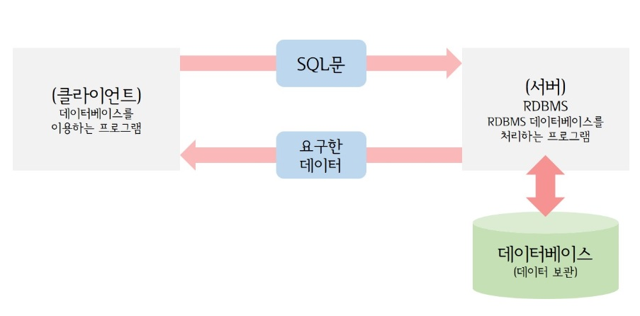

> day14 배운 내용 : 데이터베이스(database) | SQL 기본 규칙 및 데이터 관리

### 1. 데이터베이스란 무엇인가?

- 대량의 정보를 컴퓨터가 효율적으로 접근할 수 있도록 가공 및 저장한 것

- 데이터베이스를 관리하기 위한 컴퓨터 시스템을 '데이터베이스 관리 시스템(DBMS)'

  → 대량의 데이터를 다수의 사람이 안전하고 쉽게 다룰 수 있도록 함

- 데이터베이스의 종류 : 계층형 | 관계형 | 객체지향 | XML | 키-밸류형

> **관계형 데이터베이스**(Relational Database : RDBS) : 현재 가장 폭넓게 이용되고 있는 데이터베이스 → 엑셀 시트처럼 열과 행으로 이루어진 **2차원 표 형식**으로 데이터를 관리하기 때문에 이해하기 쉽다는 특징 / 또한 **SQL(Structured Query Language)**이라는 전용 언어를 사용해서 데이터를 처리

> 키-밸류형 데이터스토어(Key-Value Store  : KVS) : 검색에 사용되는 키(Key)와 값(Value)을 조합해서 단순한 형태로 데이터를 저장하는 데이터베이스 / 구글 등 대량의 데이터를 초고속으로 검색해야 하는 웹 서비스 등에서 사용되면서 주목 받고 있음

### 2. 데이터베이스 구성



- 일반적으로 RDBMS는 '클라이언트-서버(C/S)' 시스템 구성

- *클라이언트가 원하는 데이터를 담은 SQL문을 서버인 RDBMS에 전송하여 처리*

- RDBMS는 SQL문에 요청된 데이터를 반환하거나, DB에 저장되어 있는 데이터를 변경

- 한 대의 컴퓨터에서 RDBMS와 클라이언트 동시에 동작시킬 수 있으며, 서로 다른 컴퓨터도 가능 

- 다수의 클라이언트가 동시에 하나의 데이터베이스를 읽고 쓰는 것도 가능

  ∴ 데이터베이스는 클라이언트보다 높은 사양의 서버를 가진 컴퓨터가 요구 됨

- 데이터는 2차원 표로 구성이 됨 → '테이블' 또는 '표'라고 함

- SQL문에 의해 클라이언트에 반환되는 데이터는 반드시 테이블과 같은 형식의 2차원 형태이며, 행 단위로 데이터를 읽고 씀 

- 하나의 셀 안에는 하나의 데이터만

### 3. SQL(Structured Query Language) 개요

- SQL은 몇 개의 키워드와 테이블명, 열명 등을 조합한 하나의 구문으로 처리 내용을 기술

  → 관계형 데이터베이스를 제어하기 위한 언어

-----------------------------------------------------------------------------------------------------------------------------------------------------------

#### 3-1.  SQL의 세 가지 분류

**① DDL(Data Definition Language, 데이터 정의 언어)**

: 데이터를 저장하는 데이터베이스 및 테이블을 생성, 삭제하기 위한 것

- `CREATE` : 데이터베이스나 테이블 등을 작성 

> 데이터베이스나 테이블, 열 등의 이름에 사용할 수 있는 문자 : 영문자, 숫자, 언더바(_)
>
> 이름의 첫 글자는 반드시 숫자가 아닌 '영문자' & 예약어(명령어)는 사용불가

```sql
CREATE TABLE T_USER; -- 테이블 만듦
DESC T_USER; --만들어진 테이블의 구조 파악
```

```sql
CREATE TABLE T_PRODUCT(
    ID VARCHAR2(10), -- 10자리
    NAME VARCHAR2(20) NOT NULL, -- 'NOT NULL' 공백허용안함
    PRICE NUMBER(10,1) -- 소수(10자리의 정수와 소수 첫째자리)
);
```

> CHAR형은 고정문자열 ∴ 자리수가 정해져 있어 빈 자리는 공백으로 출력
>
> VARCHAR형은 가변문자열 ∴ 공백을 제외하고 출력 / 하지만 자리수 초과는 안 됨

- `DROP` : 데이터베이스나 테이블 등을 삭제 → 데이터 모두 제거 ∴ 복구 불가능

```SQL
DROP TABLE T_USER;
```

- `ALTER` : 데이터베이스나 테이블 등의 구성을 변경 / 제약조건변경 또는 COLUMN 추가

```sql
ALTER TABLE T_PRODUCT ADD(REGDATE DATE); -- 열을 추가
ALTER TABLE T_PRODUCT DROP(RDGDATE DATE); -- 열을 삭제
```

```SQL
ALTER TABLE T_PRODUCT ADD PRIMARY KEY(ID); -- ID는 중복방지
ALTER TABLE T_USER MODIFY(NAME UNIQUE); -- 이렇게도 가능
```

```sql
ALTER TABLE T_PRODUCT MODIFY(NAME CHAR(10)); -- 사이즈 변경
```

```sql
ALTER TABLE T_PRODUCT RENAME COLUMN NAME TO UNAME; -- NAME → UNAME
```

```sql
ALTER TABLE T_PRODUCT RENAME TO PRODUCT; -- TABLE NAME 변경
```

```sql
ALTER TABLE T_PRODUCT RENAME COLUMN PRICE TO T_PRICE; -- COLUMN NAME 변경
```

**② DML(Data Manipulation Language, 데이터 조작 언어) → 가장 많이 사용!**

: 테이블의 행을 검색하거나 변경하기 위한 것

- `SELECT` : 테이블에서 행을 검색

```SQL
SELECT * FROM T_USER;
```

- `INSERT` : 테이블에 신규 행을 등록

```SQL
INSERT INTO T_USER VALUES('id06','pwd06',NULL); -- 값이 없는 것 'NULL'로
INSERT INTO T_USER VALUES('id07','pwd07',''); 
-- 'NOT NULL'로 설정 시, ''은 데이터 저장이 안 됨
ALTER TABLE T_PRODUCT MODIFY (PRICE DEFAULT 1000); 
-- 값 없으면 'DEFAULT' 값 지정하여 설정 가능
```

- `DELETE` : 테이블에서 행을 삭제

```sql
DELETE FROM T_USER; -- 모든 데이터 지움
DELETE FROM T_USER WHERE ID='id05'; 
-- ID가 'id05'인 행만 지워짐
-- WHERE을 사용하여 원하는 데이터의 행 선택이 가능함
```

- `UPDATE` 

```SQL
UPDATE T_USER SET PWD='111', NAME='공말숙'; -- 모든 값이 UPDATE 됨
UPDATE T_USER SET PWD='111', NAME='공말숙' WHERE ID='id03';
-- ID는 고유 값이므로 WHERE로 조건을 걸어 해당하는 행의 비밀번호와 이름만 변경
```

**③ DCL(Data Control Language, 데이터 제어 언어)**

: 데이터에서 처리한 변경 내용을 확정하거나 취소하기 위한 것 & RDBMS 사용자에게 처리 권한 부여하기도 함

- `COMMIT` : 데이터베이스 변경 내용을 확정
- `ROLLBACK` : 데이터베이스 변경 내용을 취소

> 'ROLLBACK'은 취소가 가능하지만, 'COMMIT'은 복구가 불가능함

- `GRANT` : 사용자에게 처리 권한을 부여
- `REVOKE` : 사용자 처리 권한을 제거

-----------------------------------------------------------------------------------------------------------------------------------------------------------

#### 3-2. SQL의 기본적인 작성 규칙 

① SQL 문 마지막에 세미콜론(;)을 붙임

② 대문자와 소문자 구분 없이 키워드 사용 할 수 있음

★ 하지만 테이블에 등록된 데이터는 대문자/소문자 구분이 필요!

③ 문자열을 SQL 안에 기술할 경우, 작은 따옴표(')로 문자열을 감싸기

④ 단어는 공백 문자나 줄바꿈 문자로 구분 → CREATE TABLE Goods

