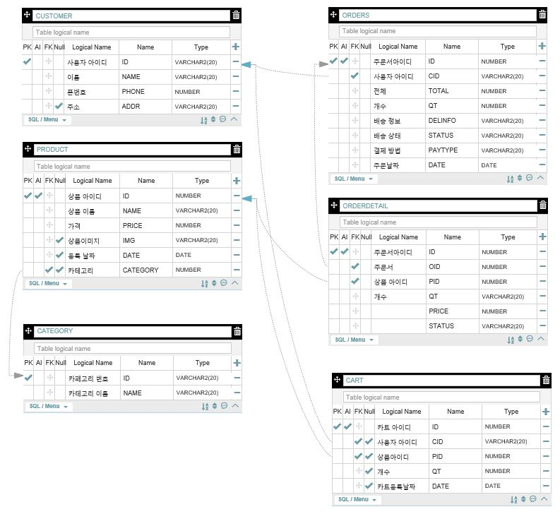

> day40 배운 내용 : 쇼핑몰 ERD 작성 및 데이터베이스 구축

## 1. 쇼핑몰 ERD

> ERD (Entity-Relationship Diagram) : 데이터베이스에 저장할 데이터를 개체(entity)와 관계(relationship)를 중심으로 작성한 것



## 2. 데이터베이스 구축

### 2-1. DDL (Data Definition Language, 데이터 정의 언어)

```sql
-- TABLE 생성
CREATE TABLE CUSTOMER
(
    ID       VARCHAR2(20)    NOT NULL, 
    NAME     VARCHAR2(20)    NOT NULL, 
    PHONE    NUMBER          NOT NULL, 
    ADDR     VARCHAR2(20)    NULL, 
    CONSTRAINT CUSTOMER_PK PRIMARY KEY (ID)
);

CREATE TABLE PRODUCT
(
    ID          NUMBER          NOT NULL, 
    NAME        VARCHAR2(20)    NOT NULL, 
    PRICE       NUMBER          NOT NULL, 
    IMG         VARCHAR2(20)    NULL, 
    DATE        DATE            NULL, 
    CATEGORY    NUMBER          NULL, 
    CONSTRAINT PRODUCT_PK PRIMARY KEY (ID)
);

CREATE TABLE CATEGORY
(
    ID      VARCHAR2(20)    NOT NULL, 
    NAME    VARCHAR2(20)    NOT NULL, 
    CONSTRAINT CATEGORY_PK PRIMARY KEY (ID)
);

CREATE TABLE ORDERS
(
    ID         NUMBER          NOT NULL, 
    CID        VARCHAR2(20)    NOT NULL, 
    TOTAL      NUMBER          NOT NULL, 
    QT         NUMBER          NOT NULL, 
    DELINFO    VARCHAR2(20)    NOT NULL, 
    STATUS     VARCHAR2(20)    NOT NULL, 
    PAYTYPE    VARCHAR2(20)    NOT NULL, 
    DATE       DATE            NOT NULL, 
    CONSTRAINT ORDER_PK PRIMARY KEY (ID)
);

CREATE TABLE ORDERDETAIL
(
    ID        NUMBER          NOT NULL, 
    OID       NUMBER          NOT NULL, 
    PID       NUMBER          NOT NULL, 
    QT        VARCHAR2(20)    NOT NULL, 
    PRICE     NUMBER          NOT NULL, 
    STATUS    VARCHAR2(20)    NOT NULL, 
    CONSTRAINT ORDERDETAIL_PK PRIMARY KEY (ID)
);

CREATE TABLE CART
(
    ID      NUMBER          NOT NULL, 
    CID     VARCHAR2(20)    NULL, 
    PID     NUMBER          NULL, 
    QT      NUMBER          NULL, 
    DATE    DATE            NULL, 
    CONSTRAINT CART_PK PRIMARY KEY (ID)
);

-- SEQUENCE 생성
CREATE SEQUENCE PRODUCT_SEQ
START WITH 1
INCREMENT BY 1;

CREATE SEQUENCE ORDER_SEQ
START WITH 1
INCREMENT BY 1;

CREATE SEQUENCE ORDERDETAIL_SEQ
START WITH 1
INCREMENT BY 1;

CREATE SEQUENCE CART_SEQ
START WITH 1
INCREMENT BY 1;

-- 제약조건 설정 (PK,FK)

-- PRIMARY KEY(PK)
ALTER TABLE CUSTOMER ADD PRIMARY KEY(ID);
ALTER TABLE PRODUCT ADD PRIMARY KEY(ID);
ALTER TABLE CATEGORY ADD PRIMARY KEY(ID);
ALTER TABLE ORDERS ADD PRIMARY KEY(ID);
ALTER TABLE ORDERDETAIL ADD PRIMARY KEY(ID);
ALTER TABLE CART ADD PRIMARY KEY(ID);

-- FOREIGN KEY(FK)
ALTER TABLE PRODUCT ADD FOREIGN KEY(CATEGORY) REFERENCES CATEGORY(ID);
ALTER TABLE CART ADD FOREIGN KEY(CID) REFERENCES CUSTOMER(ID);
ALTER TABLE CART ADD FOREIGN KEY(PID) REFERENCES PRODUCT(ID);
ALTER TABLE ORDERDETAIL ADD FOREIGN KEY(PID) REFERENCES PRODUCT(ID);
ALTER TABLE ORDERDETAIL ADD FOREIGN KEY(OID) REFERENCES ORDERS(ID);
```


### 2-2. DML (Data Manipulation Language, 데이터 조작 언어) :star:

```sql
-- TABLE 내 DATE 등록
INSERT INTO CUSTOMER VALUES('id01','안소','01012345678','경기도 화성시 동탄3동');
INSERT INTO PRODUCT VALUES(PRODUCT_SEQ.NEXTVAL,'티셔츠',30000,'IMG01',SYSDATE,1);
INSERT INTO CATEGORY VALUES(CATEGORY_SEQ.NEXTVAL,'옷');
INSERT INTO ORDERS VALUES(ORDERS_SEQ.NEXTVAL,'id01',30000,1,'배송정보','배송시작','신용카드',SYSDATE);
INSERT INTO ORDERDETAIL VALUES(ORDERDETAIL_SEQ.NEXTVAL,1,1,1,30000,'배송시작');
INSERT INTO CART VALUES(CART_SEQ.NEXTVAL,'id02',1,1,SYSDATE);
```

```sql
-- 아이디가 'id01'인 사람이 고른 상품의 이름과 가격, 개수 정보 출력하기
SELECT P.NAME ,P.PRICE*T.QT FROM CART T, CUSTOMER C, PRODUCT P 
WHERE C.ID=T.CID AND T.PID = P.ID
AND T.CID='id01';
```


