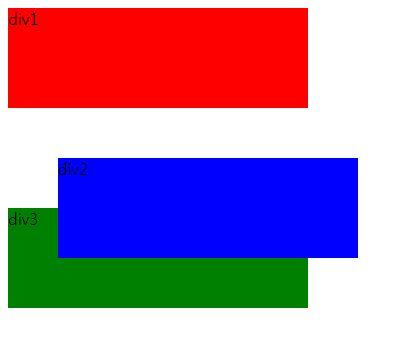
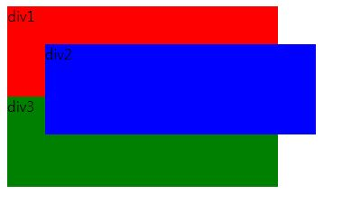
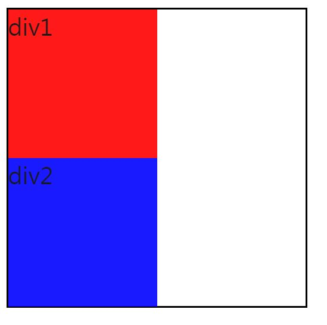

> day23 배운 내용 : CSS3 레이아웃 → 요소의 위치와 의미적 요소를 이용한 레이아웃 설정

## 1. 레이아웃의 기초

- HTML 요소의 레이아웃을 설정하는 것은 '집 안의 가구를 배치하는 것'

- 웹 브라우저는 각 요소를 '사각형'으로 간주한 '박스모델(box model)'로 이루어짐

  → 사각형에는 패딩과 경계선 그리고 마진이 붙어 있음

- HTML 요소는 블록 요소이거나 인라인 요소 중 하나에 속함

> 블록(block) 요소 : 화면의 한 줄을 전부 차지 & 인라인(inline) 요소 : 한 줄에 차례로 배치 됨

|                          블록 요소                           |                        인라인 요소                        |
| :----------------------------------------------------------: | :-------------------------------------------------------: |
| `<h1>` `<p>` `<ul>` `<li>` `<table>` `<pre>` `<blockquote>` `<div>` `<form>` `<header>` `<nav>` | `<a>` `` `<strong>` `<em>` `<br>` `<input>` `<span>` |

- 'display'를 이용하여 얼마든지 속성을 변경할 수 있음

```css
style{
display : inline; /* display 속성을 인라인으로 */
display : block; /* display 속성을 블록으로 */
} 

style{
    display : none; /* 없는 것으로 간주됨 */
    display : hidden; /* 화면에서 감춰짐 */
}
```


## 2. 요소 위치 정하기

> top bottom left right 속성을 설정하려면 `position`이 먼저 설정되어야 가능

> 요소의 위치를 결정하는 값은 모두 오프셋(offset)

#### 2-1. 정적 위치 설정 (static positioning) 

- 페이지의 정상적인 흐름에 따라 요소의 위치가 결정 

  → 흐름에 따라 블록 요소가 박스처럼 상하로 쌓이게 되고, 인라인 요소는 한 줄로 차례대로 배치

- 정적 위치 설정은 'top bottom left right' 속성의 영향을 받지 않음

#### 2-2. 상대 위치 설정 (relative positioning)

- 정상적인 위치에서 상대적으로 요소가 배치되는 방법

```css
#d2 {
	background: blue;
	position:relative;
	left:50px;
	top:50px;
}
```



> 정상적인 위치에서 위쪽 50px, 왼쪽으로 50px  만큼 이동

> 상대 위치로 설정된 요소는 다른 요소 위에 겹쳐질 수 있으나, 요소를 위해 할당된 공간이 없어지는 것은 아님

#### 2-3. 절대 위치 설정 (absolute positioning)

- 전체 페이지(body)를 기준으로 배치하는 방법 → 페이지 시작 위치를 기준으로 배치가 됨

```css
div {
    position : absolute;
	width: 100px;
	height: 100px;
}
```



#### 2-4. 고정 위치 설정 (fixed positioning)

- 브라우저 윈도우에 상대적으로 요소의 위치를 잡음
- 윈도우가 스크롤된다고 하여도 화면에서 요소는 움직이지 않음

#### 2-5. float 속성

- 하나의 콘텐츠 주위로 다른 콘텐츠가 조화를 이룰 수 있도록 할 때 사용

  → 컨테이너 안 다른 요소가 이 요소를 감싸며 배치가 됨 (position과 offset 설정은 모두 무시)

- float 속성은 요소를 컨테이너의 왼쪽과 오른쪽으로 배치할 때만 사용

- `float:left`와 `float:right`를 적절히 사용하면 웹 페이지 구성에 용이함

> float 속성의 특징 더 공부하기 _190617 memo 

#### 2-6. `z-index` 

- 요소의 스택 순서를 지정

```css
div {
    position : absolute;
	width: 100px;
	height: 100px;
	opacity:0.9; /* 객체의 투명도 조절 → 범위는 0부터 1까지 */
}

#d1 {
	background: red;
	z-index : 100;
}

#d2 {
	background: blue;	
	left : 30px;
	top : 30px;
	z-index : 10;
}

#d3 {
	background: green;
	left : 60px;
	top: 60px;
	z-index : 1;
} /* z값이 클 수록 앞에 놓이게 됨 */
```

#### 2-7. `overflow`

- 자식 요소가 부모 요소의 범위를 벗어났을 때 어떻게 처리할 것인가 지정

```css
<style>
#out{
border : 1px solid black;
width:200px;
height:200px;
overflow: hidden; /* 부모 영역을 벗어나는 부분은 보이지 않도록 함 */
}
</style>
```



> overflow를 `hidden`으로 설정한 경우 : 부모 영역을 벗어난 부분 보이지 않음

> scroll : 벗어나는 부분을 스크롤 할 수 있도록 & auto : 자동으로 스크롤 바 나타남


## 3. 의미적 요소를 이용한 레이아웃

```css
<header> 문서의 머리말 </header>
<section> 문서의 섹션 </section>
<footer> 문서의 꼬리말 </footer>

<nav> 내비게이션 링크 → 메뉴바 생성 </nav>
```

> 이들 모두 `<div>`의 일종