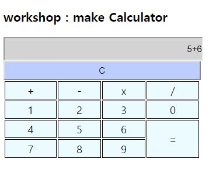

> day26 배운 내용 : 배열 생성 및 출력 | 함수 | 입출력 | 객체 | DOM

## 1. 배열 생성 및 출력

- 배열 생성하기

```html
<script>
var person = [
	{id:"id01",name:"이말숙"},
	{id:"id01",name:"김말숙"},
	{id:"id03",name:"정말숙"},
	{id:"id04",name:"황말숙"},
	{id:"id05",name:"오말숙"}
] /* 배열 안에 여러 개의 object */
</script>
```

- 생성한 배열 출력하기

```html
for(var i=0; i<person.length; i++){
		result += '<tr>'
		+'<td>'+person[i].id+'</td>'
		+'<td>'+person[i].name+'</td>'
		+'</tr>';
	};
```


## 2. 함수

- 함수의 기본 형태

```javascript
function 함수이름(){
         함수의 내용 // 호출하면 실행되는 코드를 여기에 기입
}
```

- 인수 (argument) : 함수를 호출할 때 함수로 전달할 수 있는 값
- 매개 변수 (parameter) : 함수를 선언할 때 인수를 받을 변수

- 무명 함수 (anonymous function) : 함수에 이름을 주지 않고 만들어서 한 번만 사용하는 경우

```javascript
var greeting = function()
{
alert("안녕하세요?");
};
```

> 자바스크립트에서 함수는 객체처럼 취급되기 때문에 변수에 저장하여 나중에 호출하여 사용할 수 있는데,    무명 함수는 함수를 만들어서 '한 번만' 사용함

- 지역 변수 (local variable) : 함수 안에서만 사용 ∴ 다른 함수에서도 똑같은 이름 사용 가능

``` javascript
function add(a,b){
    var sum = 0; // 지역 변수로 함수 안에서만 유효
    sum a+b;
    return sum;
}
```

- 전역 변수 (global variable) : 함수 외부에서 선언되어 웹 페이지 상의 모든 스크립트와 함수에서 사용 가능 

```javascript
var sum = 0;
function add(a,b){
    sum = a+b;
    return sum;
}
```


## 3. JavaScript의 입출력

- `alert()` :
  - 사용자에게 경고를 하는 윈도우를 띄우는 함수
  - 경고 뿐만 아니라 출력을 표시 및 확인할 때도 사용
  - 윈도우가 나타나면 사용자가 윈도우를 제거할 때까지 다음 작업 진행되지 않음
- `confirm()` :
  - 사용자에게 어떤 사항을 알려주고 확인이나 취소를 요구하는 윈도우를 띄움
  - 사용자가 확인을 클릭하면 true를 반환하고, 그렇지 않으면 false를 반환
- `prompt()` : 
  - 사용자에게 어떤 사항을 알려주고 답변을 입력할 수 있는 윈도우를 띄옴
  - 사용자가 입력한 내용을 문자열로 반환

```javascript
var c = prompt('Input yout name...','James');
```


## 4. 객체

### 4-1. 객체의 정의

- 자바스크립트의 가장 기초적인 자료형은 객체(object)

  → 거의 모든 것이 객체 ∴ 문자열(String), 수치형(Number), 부울형(Boolean)도 객체처럼 구현이 가능

- 객체는 실제 세상에 존재하는 사물을 모델링한 것

- 객체는 데이터와 동작을 갖고 있음

  - 데이터(data) : 객체가 가지고 있는 특성값
  - 동작(action) : 객체가 수행할 수 있는 행동

  → 사물의 데이터와 동작은 분리되지 않고 하나로 합쳐져 있음

- 자바스크립트에서 객체의 데이터와 동작은 각각 '변수'와 '함수'로 표현

- 이때 객체 안의 변수를 '속성(property)'이라 하고, 객체 안의 함수를 '메서드(method)'라고 부름

### 4-2. 객체의 생성 및 사용

- 내장 객체(built-in object) : 생성자가 미리 작성되어 있음
  - 생성자를 정의하지 않고도 사용이 가능
  - Data, String, Array와 같은 객체가 내장객체
  - HTML 문서를 나타내는 document도 내장 객체
- 사용자 정의 객체(custom object) : 사용자가 생성자를 정의

```html
<script>
var Car = { /* 객체를 만듦 */
	name: 'ki',
	size: 1000,
	go: function(){
		return this.name + 'Go'; /* 객체 안에서 사용하는 것이 this */
	},
	stop: function(){
		return this.name + 'Stop';
	}
};
</script>
```

- 객체 멤버 사용하기

```javascript
// 객체이름.속성이름="변경 값";
myCar.color = "red";

// 객체이름.메서드 이름;
myCar.brake();
```

- 객체와 함수

```javascript
function a(){alert('a');};
function a(){alert('aa');};
a(); 
```

> 함수 이름 같아도 오류는 나지 않음 → 하지만 프로그램이 동작하지 않을 수 있음

```javascript
var SK = {
	data : 10,
	a:function(){alert('sk'); }
};
var HB = {
	data : 20,
	a:function(){alert('hb'); }
};

SK.a();
HB.a();
```

> 같은 이름의 함수를 사용하고 싶으면 object 생성 후 가능

[ 자바스크립트의 내장 객체 ] 

- `Date` : 날짜와 시간 작업을 하는데 사용되는 가장 기본적인 객체

```html
<script>
var t = function(){
	var time = document.getElementById('time');
	var result = '';
	var date = new Date();
	result = date.toLocaleTimeString();
	time.innerHTML = result;
};
setInterval(t,1000); 
/* 1초에 한 번씩 t라는 함수를 호출하기 : setInterval은 반복함수 */
</script>
```

> 이 외 Numbre 객체와 String 객체도 있음! 필요할 때 찾아보기

## 5. DOM

- 문서객체모델 (Document Object Model, DOM) :

  - DOM은 HTML 문서의 계층적인 구조를 트리(tree)로 표현한 것

  - 트리에 있는 하나의 잎을 '노드(node)'라고 함 

    → 노드(node)는 문서 안에 들어있는 요소나 텍스트를 나타냄

- id를 설정하여 HTML의 요소를 찾을 수 있음 (데이터를 가져오고 뿌리기)

```html
<head>
    <script>
        function c1(){
            /* 데이터를 가져오거나 뿌릴 때 둘 다 innerText 사용 */
            var h1 = document.getElementById('h1').innerText; // 가져오기
            document.getElementById('h1').innerText = h1 + 'ADD TEXT'; // 뿌리기
        };
    </script>
</head>

<body>
    <h1 id="h1">Header</h1>
    ID<input id="id" type="text" name="id"><br>
    <button onclick="c1();">Click1</button>
</body>
```

> getElementById는 단수 ∵ ID는 유일하기 때문 → 나머지는 복수형도 존재

> 태그이름으로 요소 찾기도 가능

-----------------------------------------------------------------------------------------------------------------------

**[ day26 workshop result 1 ]** [계산기](https://github.com/xuansohx/TIL/blob/master/%EC%8B%A4%EC%8A%B5%EC%BD%94%EB%93%9C/web/cal.html) 



**[ day26 workshop result 2 ]** [음료자판기](https://github.com/xuansohx/TIL/blob/master/%EC%8B%A4%EC%8A%B5%EC%BD%94%EB%93%9C/web/machine.html)


